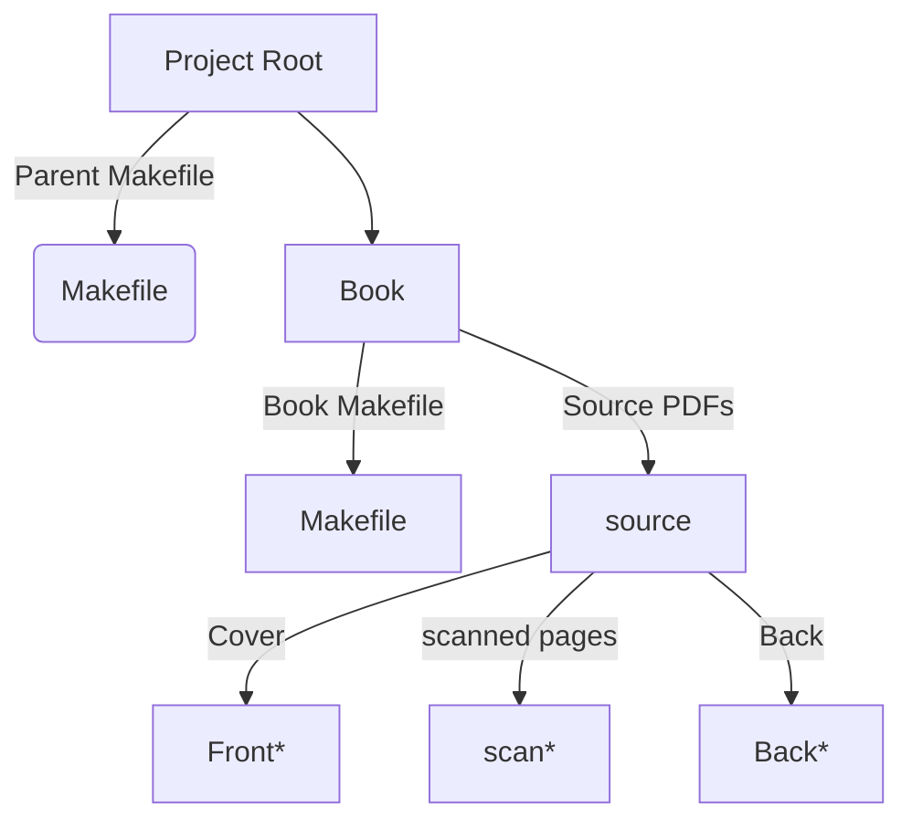

# DiAgnostiK -- Digital Books

## Information

A makefile to clean up, stitch together, and read a scanned book.

### Prerequisites

#### OCR

- `pipx install ocrmypdf`
- `apt-get install tesseract-ocr-deu`

    - for ocr: `ocrmypdf -l deu`

- `apt-get install unpaper`

    - for ocr: `ocrmypdf --clean`

- `apt install pngquant`

    - for optimize 2 and 3: `ocrmypdf --optimize 3`

- `apt install jbig2`

    - also for optimize 2 and 3

#### pdf Handling

- `apt install poppler`
    
    - for `pdfimages`
    - for `pdfunite`
    - for `pdfinfo`

#### Image Modifications

- `apt install imagemagick`

    - for `convert`

### Usage

Use `make` (or better `remake`) to built the whole Project. The scans have to be positioned in the *source* folder of the book. Run `make` from the books folder.

The Makefile in the *book* folder contains just the parameters. Or run `remake -c` from the *book* folder with no Makefile.

### Parameters

Parameters in the Book Makefile or CMD Line can be:

- OUTPUT ... the name of the Book
- ROTATE_FRONT ... 1 or 0 if the front page should be rotated
- ROTATE_BACK ... 1 or 0 if the back page should be rotated
- OPTIMIZE ... 0,1,2 or 3 to control `ocrmypdf` image optimization

### Sources

Scanned books are expected to have separate files for front, content and back.
Coverpages should start with "Front" or "Back" respectively. Content should start with "scan" and more text as to sort them natively.
Everything needs to be a pdf.

